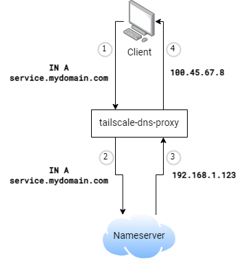

# Tailscale DNS Proxy

*Note: This project has no affiliation with [Tailscale](https://www.tailscale.com/)*

DNS server that rewrites responses containing private IPs corresponding to your Tailscale machines to their Tailnet IP addresses.

## Usage

### Resolvers

## FAQ

### Why would anyone want this?

### Why not use a subnet router?

### Why not use a split-horizon DNS server?

### Why not use Tailscale IPs exclusively?

### Why not just assign your Tailnet IP to a different subdomain?

### Isn't returning private IP ranges bad because of DNS rebinding?